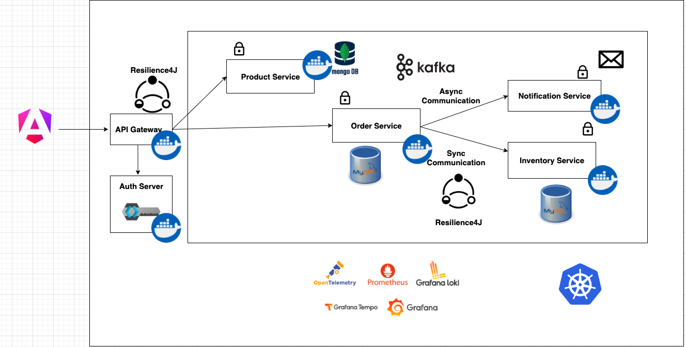

# MicroEcomm-Spring

MicroEcomm-Spring is a Spring Boot-based microservices backend for an online shopping platform. The system is designed around independently deployable services that support product catalog management, order processing, inventory management, service discovery, API routing, security, asynchronous messaging, and observability.

The project demonstrates how a modern e-commerce backend can be built using Java, Spring Boot, microservices architecture, Feign clients, Kafka, Keycloak, Docker, Prometheus, and Grafana.

## Project Description

MicroEcomm-Spring was developed as a microservices-based online shop backend that handles product catalog, order processing, inventory management, and email notification workflows. Services communicate synchronously using Feign clients and asynchronously using Kafka messaging. The system uses MongoDB and relational databases for persistence, Keycloak for authentication and authorization, and Prometheus with Grafana for monitoring and observability. Services are containerized with Docker and orchestrated locally using Docker Compose.

## Architecture Diagram



## Key Features

- Product catalog management through a dedicated Product Service.
- Order placement and order processing through a dedicated Order Service.
- Inventory validation through a separate Inventory Service.
- Email notification workflow handled through a Notification Service.
- API Gateway for centralized routing into backend services.
- Eureka Discovery Server for service registration and discovery.
- Synchronous service-to-service communication using Feign clients.
- Asynchronous event-driven communication using Kafka.
- Authentication and authorization using Keycloak.
- MongoDB for product-related data persistence.
- PostgreSQL databases for order and inventory services.
- MySQL database used by Keycloak for identity and realm storage.
- Observability support using Prometheus, Grafana, and Zipkin.
- Containerized deployment using Docker and Docker Compose.

## Technology Stack

| Area | Technologies |
|---|---|
| Language | Java |
| Backend Framework | Spring Boot, Spring Cloud |
| Architecture | Microservices |
| Service Discovery | Netflix Eureka |
| API Routing | Spring Cloud Gateway |
| Synchronous Communication | OpenFeign / Feign Clients |
| Asynchronous Messaging | Apache Kafka, Zookeeper |
| Security | Keycloak, OAuth2 / JWT-based authentication |
| Databases | MongoDB, PostgreSQL, MySQL |
| Observability | Prometheus, Grafana, Zipkin |
| Build Tool | Maven |
| Containerization | Docker, Docker Compose |
| Image Build | Jib Maven Plugin |

## Microservices Overview

| Service | Responsibility |
|---|---|
| API Gateway | Provides a single entry point for client requests and routes traffic to backend services. |
| Discovery Server | Registers and discovers microservices using Eureka. |
| Product Service | Manages product catalog data and stores product details in MongoDB. |
| Order Service | Handles order creation, order processing, and communicates with inventory services. |
| Inventory Service | Checks product availability and manages inventory-related data. |
| Notification Service | Consumes Kafka events and handles email notification workflows. |

## System Flow

1. A client sends a request through the API Gateway.
2. The API Gateway validates and routes the request to the correct backend service.
3. The Product Service handles product catalog operations.
4. The Order Service receives order requests and checks product availability.
5. The Inventory Service validates whether the requested products are in stock.
6. If the order is successfully placed, the Order Service publishes an event to Kafka.
7. The Notification Service consumes the Kafka event and sends the relevant notification.
8. Prometheus collects metrics from services.
9. Grafana visualizes system metrics and service health.
10. Zipkin provides distributed tracing across service calls.

## Project Structure

```text
MicroEcomm-Spring
├── MicroEcomm-Spring-New
│   ├── api-gateway
│   ├── discovery-server
│   ├── product-service
│   ├── order-service
│   ├── inventory-service
│   ├── notification-service
│   ├── grafana
│   ├── prometheus
│   ├── realms
│   ├── postgres-inventory
│   ├── postgres-order
│   ├── docker-compose.yml
│   └── pom.xml
├── Images
│   └── microEcom.png
└── README.md
```

## Prerequisites

Before running the project, make sure the following tools are installed:

- Java 17
- Maven
- Docker
- Docker Compose
- Git

## Getting Started

### 1. Clone the Repository

```bash
git clone https://github.com/gdsghost/MicroEcomm-Spring.git
cd MicroEcomm-Spring/MicroEcomm-Spring-New
```

### 2. Build the Project

```bash
mvn clean package -DskipTests
```

### 3. Start the System with Docker Compose

```bash
docker compose up -d
```

For older Docker Compose versions, use:

```bash
docker-compose up -d
```

### 4. Stop the System

```bash
docker compose down
```

## Useful Local URLs

| Component | URL |
|---|---|
| API Gateway | http://localhost:8181 |
| Keycloak | http://localhost:8080 |
| Eureka Discovery Server | http://localhost:8761 |
| Prometheus | http://localhost:9090 |
| Grafana | http://localhost:3000 |
| Zipkin | http://localhost:9411 |
| Kafka Broker | localhost:9092 |
| MongoDB | localhost:27017 |

## Default Access Details

### Keycloak

```text
Username: admin
Password: admin
```

### Grafana

```text
Username: admin
Password: password
```

These credentials are intended for local development only. Do not use default credentials in production environments.

## Communication Patterns

### Synchronous Communication

The Order Service uses synchronous communication to validate product availability from the Inventory Service. This is suitable for request-response operations where an immediate result is required before continuing the order workflow.

### Asynchronous Communication

Kafka is used for asynchronous event-driven messaging. After an order is placed, the Order Service can publish an event to Kafka, and the Notification Service can consume that event to trigger an email notification workflow. This improves service decoupling and allows background processes to run independently from the main order request.

## Security

The project uses Keycloak as the identity and access management solution. Keycloak provides authentication and authorization support for securing API access. The API Gateway acts as the central entry point where protected routes can be configured and validated before forwarding traffic to backend services.

## Observability

The project includes observability tooling to support monitoring and tracing:

- Prometheus collects application and infrastructure metrics.
- Grafana provides dashboards to visualize metrics.
- Zipkin supports distributed tracing for service-to-service requests.

This helps identify service health, latency issues, dependency failures, and runtime behavior across the microservices ecosystem.

## Dockerized Deployment

The project includes a Docker Compose setup that starts the required infrastructure and application services, including:

- MongoDB
- PostgreSQL databases
- MySQL for Keycloak
- Keycloak
- Zookeeper
- Kafka
- Zipkin
- Eureka Discovery Server
- API Gateway
- Product Service
- Order Service
- Inventory Service
- Notification Service
- Prometheus
- Grafana

## Development Notes

- The project uses Java 17 and Spring Boot 3.
- Maven is used as the parent build system for the multi-module project.
- Services are packaged and containerized for local orchestration.
- Docker Compose is the recommended way to start the full local environment.
- Default credentials and local ports should be changed before any production-style deployment.

## Future Improvements

- Add centralized configuration using Spring Cloud Config.
- Add automated integration tests for service-to-service workflows.
- Add API documentation using OpenAPI / Swagger.
- Add CI/CD pipeline support.
- Add production-ready secret management.
- Add retry, timeout, and circuit breaker patterns using Resilience4j.
- Add structured logging and centralized log aggregation.
- Add Kubernetes deployment manifests.

## Skills Demonstrated

- Designing and implementing Spring Boot microservices.
- Building distributed systems with synchronous and asynchronous communication.
- Securing services using Keycloak.
- Using Kafka for event-driven architecture.
- Managing multiple databases across microservices.
- Applying Docker-based local orchestration.
- Implementing monitoring and observability with Prometheus, Grafana, and Zipkin.
- Structuring a multi-module Maven project.

## License

This project is intended for learning, demonstration, and portfolio purposes. Add a license file if you plan to distribute or reuse the project publicly.
